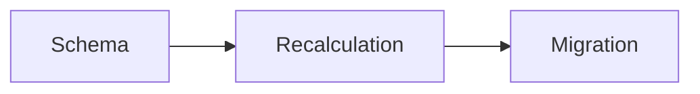

# What content renders as

Content fields are markdown and are shown rendered: a task's brief (`context`, `constraints`,
`criteria`) and its work (`plan`, `progress`, `result`), the `body` of a stage, the `body` of a
journal entry. The goal (`description`) renders too, as plain paragraphs.

Ordinary markdown works — headings, lists, tables, links, inline code, fenced code with
highlighting. Two things are worth knowing because guessing them wrong is silent.

## Headings are also edit handles

`content_set_section(code, field, heading, text)` replaces one section, from its heading down to
the next heading of equal or higher level. That makes headings the unit you can rewrite later
without resending the whole field.

Two consequences for how you write:

- **Give a section a heading you can name.** A unique one: a heading that repeats is refused,
  and you then have to address it by path (`## Plan > ### Risks`).
- A `#` line inside a fenced block is code, not a heading, and never ends a section — a plan
  with a shell example in it stays intact.

## Diagrams

A fence tagged `mermaid` renders as a real diagram. Anything the renderer does not recognise
degrades to a plain code block, silently — you will not be told.

````

````

Recognised types: `flowchart` (and `graph`), `sequenceDiagram`, `classDiagram`, `stateDiagram`
(and `stateDiagram-v2`), `erDiagram`, `xychart-beta`.

Reach for one where the point *is* a structure — a pipeline, a state machine, a data schema, a
call flow. A diagram of three boxes that a sentence already said is worse than the sentence.

## Length

Every content field edited through `content_set` and its neighbours is refused rather than
trimmed when it goes over, and the refusal names the length of the result and how much over you
are. So are `plan`, `progress` and `result` whichever way they are written, and the body passed
to `stage_add`. This matters for plans specifically: the file list sits at the end, so trimming
would remove the part worth keeping.

| Content field | Limit |
|---|---|
| `context` | 4048 |
| `constraints`, `criteria` | 2048 |
| `plan` | 8192 |
| `progress` | 16384 |
| `result` | 2048 |
| stage `body` | 8192 |
| journal entry `body` | 2048 |

If a plan is pressing the limit, the detail belongs in stages (an extended task) or a subtask.

The other text fields — and the brief and the entry body when passed to `task_create`,
`task_update` or `note_add` — are cut at their limit **without a word**. Stay under these, and
read the task back when a field was long:

| Field | Limit |
|---|---|
| title (task, stage, entry, group) | 128 |
| goal `description`, stage `description` | 512 |
| group `description` | 128 — refused over it, not cut |
| `context` | 4048 |
| `constraints`, `criteria` | 2048 |
| entry body passed to `note_add` | 2048 |
| `evidence`, `resolution` | 1024 |
